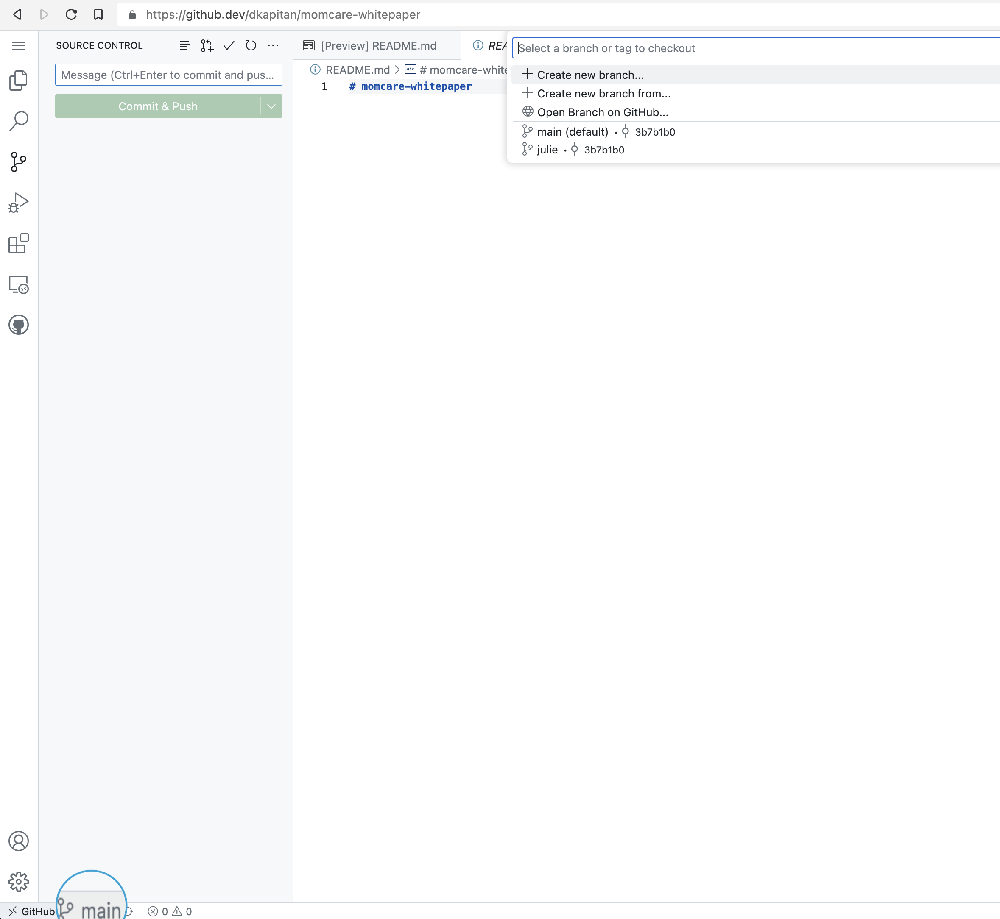
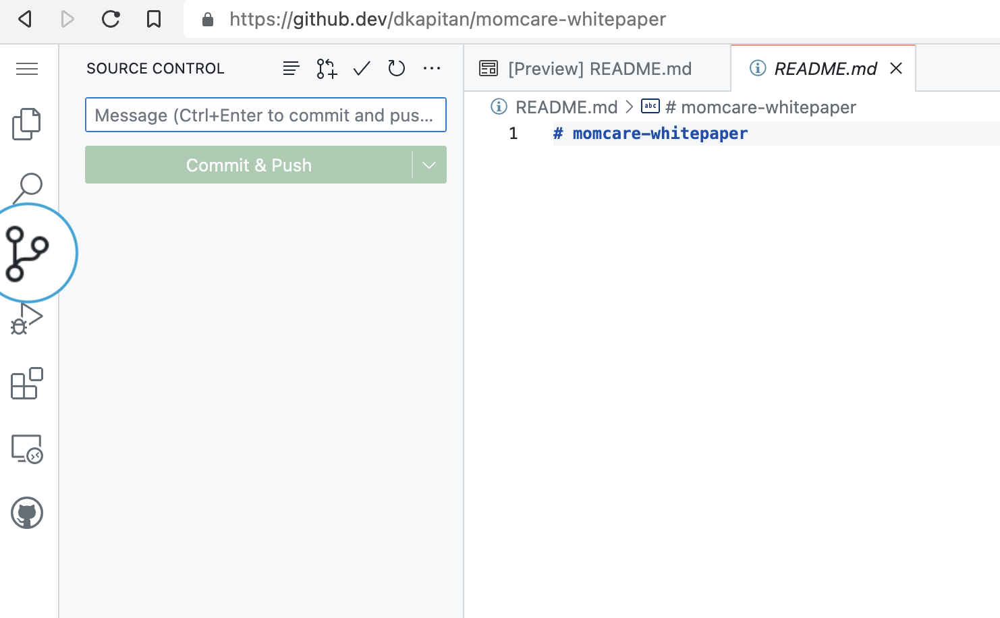

# Health Data Commons whitepaper

## Scope and audience

This repository contains the source code for the Health Data Commons (KDC) demonstrator project. It is written in [Quarto](https://quarto.org). The document is intended for internal use at PharmAccess Foundation. In due course, parts of this whitepaper are intended for publications

> Read the whitepaper at [http://health-data-commons.pharmaccess.org/](http://health-data-commons.pharmaccess.org/)
> 
## How to work with Quarto and GitHub

### Getting started

- Read the short introduction on how author documents in markdown using Quarto ([link](https://quarto.org/docs/authoring/markdown-basics.html))
- Read the short introduction on how to use branches in the GitHub flow for version control ([link](https://docs.github.com/en/get-started/quickstart/github-flow)).
- Read how to use the web IDE for GitHub ([link](https://docs.gitlab.com/ee/user/project/web_ide/))
  - The short introduction to this workflow is that everyone works in their own branch, and changes to the document are merged into the `main` branch.

### Working in the online editor

- Navigate to [https://github.dev/PharmAccess/health-data-commons-intranet](https://github.dev/PharmAccess/health-data-commons-intranet), this will launch your online editor
- Click on the branching icon on the bottom left. A pop-up appears where you can select the branch to work on. Select your own branch.

- Make your changes in the various documents
- Commit your changes using the `source control` icon in the left menu
  

- Open a pull request, so that others can review and approve your changes.
- once pull request is approved and merged, the changes will be visible on the website.
